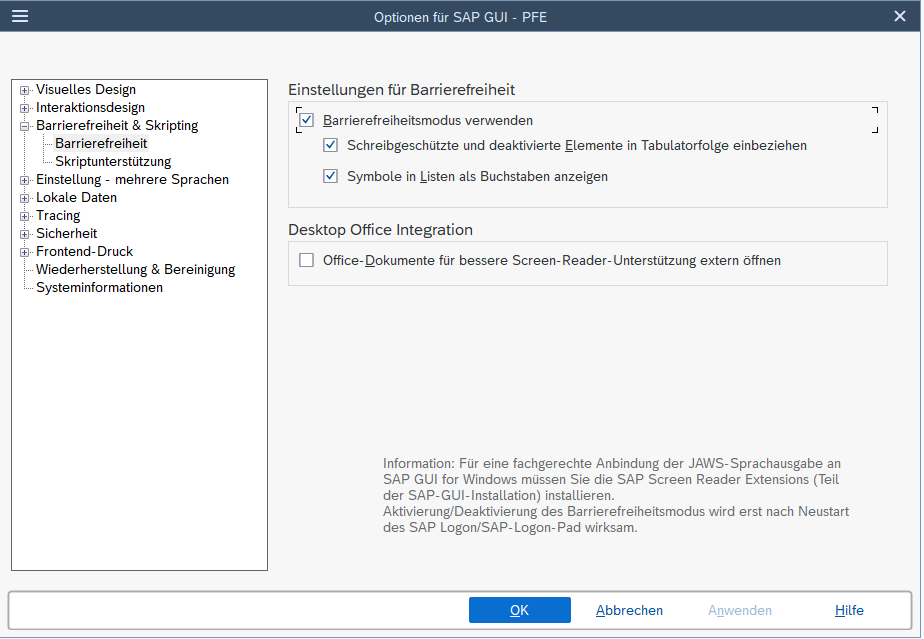

<!-- fullWidth: false tocVisible: false tableWrap: true -->
# Barrierefreiheit

## 5.1 Zweck

Die SAP GUI for Windows verfügt über einen Accessibility Mode. Er unterstützt die barrierefreie Nutzung der Anwendung und ist für den Einsatz mit assistiven Technologien vorgesehen.

Dieses Kapitel beschreibt:

- die Aktivierung des Accessibility Mode,
- den erforderlichen Neustart von SAP Logon beziehungsweise SAP Logon Pad und
- die Einbeziehung schreibgeschützter und deaktivierter Elemente in die Tabulatorreihenfolge.

## 5.2 Voraussetzungen

Für die beschriebenen Einstellungen gelten folgende Voraussetzungen:

- SAP GUI for Windows ist installiert.
- Sie können die SAP-GUI-Optionen öffnen.
- Sie dürfen die SAP-GUI-Einstellungen ändern.

Die beschriebenen Schritte wurden unter Windows 10 mit SAP GUI Version 8000.1.15.1161, Build 2285874 und Patchlevel 15 im Quartz Theme geprüft. Während der Prüfung wurde kein Screenreader verwendet.

## 5.3 Accessibility Mode aktivieren

### 5.3.1 Einstellung öffnen

Gehen Sie wie folgt vor:

1. Starten Sie SAP Logon.
2. Öffnen Sie die SAP-GUI-Optionen.
3. Öffnen Sie den Bereich `Accessibility & Scripting`.
4. Wählen Sie die Seite `Accessibility` aus.

Abbildung 5-1: Einstellungen für Barrierefreiheit in den SAP-GUI-Optionen.

### 5.3.2 Accessibility Mode einschalten

1. Aktivieren Sie die Option `Use Accessibility Mode`. In der deutschsprachigen Oberfläche lautet die Bezeichnung `Barrierefreiheitsmodus verwenden`.
2. Übernehmen Sie die geänderte Einstellung.
3. Schließen Sie SAP Logon beziehungsweise SAP Logon Pad.
4. Starten Sie die Anwendung erneut.

> [!IMPORTANT]
> Eine Änderung am Accessibility Mode wird erst nach dem Neustart von SAP Logon beziehungsweise SAP Logon Pad wirksam. Dies gilt sowohl für die Aktivierung als auch für die Deaktivierung.
>
> Dieser Zusammenhang wurde im Praxistest PT-001 nachvollzogen.

## 5.4 Schreibgeschützte und deaktivierte Elemente in die Tabulatorreihenfolge einbeziehen

Die Option `Include read-only and disabled elements in tab chain` bewirkt, dass schreibgeschützte und deaktivierte Elemente beim Navigieren mit der Tabulatortaste nicht übersprungen werden.

Der Accessibility Mode muss aktiviert sein, damit die weiteren Optionen auf der Seite `Accessibility` aktiviert werden können.

### 5.4.1 Einstellung aktivieren

1. Öffnen Sie in den SAP-GUI-Optionen den Bereich `Accessibility & Scripting` und anschließend die Seite `Accessibility`.
2. Aktivieren Sie die Option `Include read-only and disabled elements in tab chain`. In der deutschsprachigen Oberfläche lautet die Bezeichnung `Schreibgeschützte und deaktivierte Elemente in Tabulatorfolge einbeziehen`.
3. Übernehmen Sie die geänderte Einstellung.

Die dokumentierte Wirkung der Einstellung wurde durch einen Praxistest bestätigt. Dabei wurden keine Abweichungen von der Herstellerdokumentation festgestellt.

## 5.5 Grenzen der dokumentierten Prüfung

Die Praxistests bestätigen den Aktivierungsweg des Accessibility Mode, das Neustartverhalten und die Wirkung der Option zur Tabulatorreihenfolge in der dokumentierten Testumgebung.

Die Nutzung mit einem Screenreader war nicht Bestandteil dieser Praxistests. Aussagen zum konkreten Verhalten einzelner Screenreader sind daher nicht Bestandteil dieses Kapitels.

## 5.6 Nachweise

Die veröffentlichten Aussagen sind folgenden Evidenzen und Praxistests zugeordnet:

- Accessibility Mode und Aktivierung: ACC-001-E01 und ACC-001-E02; PT-001
- Neustartverhalten: ACC-001-E03; PT-001
- schreibgeschützte und deaktivierte Elemente in der Tabulatorreihenfolge: ACC-002-E03; PT-003

Die vollständigen Quellenangaben, Testschritte und Bewertungen werden in den zugehörigen Recherchedateien und Praxistests gepflegt.
